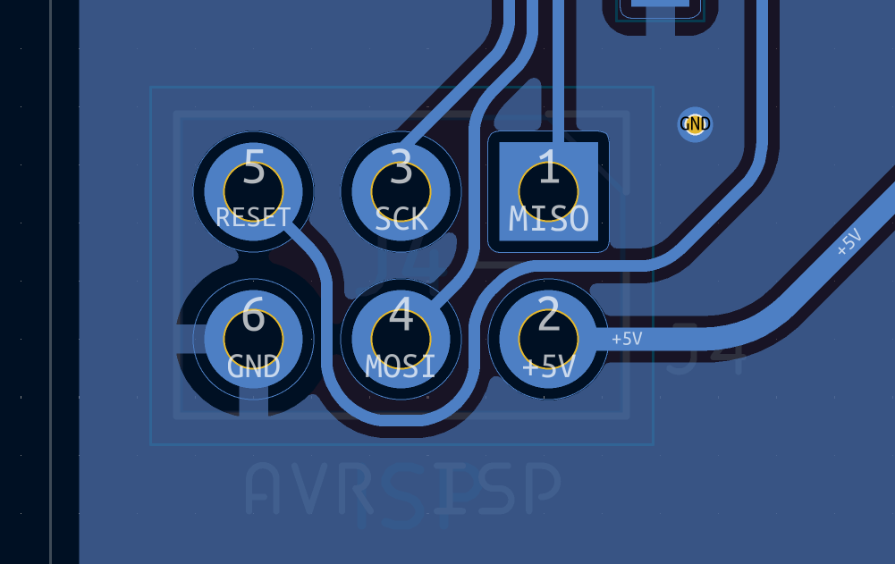

## Sandpiper keyboard PCB and enclosure design files

This repo contains the PCB files for sandpiper project.

## Notes

- This PCB is optional and is not required to be able to run sandpiper. It merely contains a custom USB keyboard that fits into the provided enclosure.
- The enclosure is also optional. Sandpiper does not requre an enclosure to function and can be booted from pretty much any Xynq7020 board with 512Mbytes of memory, an etnernet and USB controller, plus some HDMI connector leading to the FPGA pins. For boards with more memory than 512Mbytes the device tree and SDK has to be updated to shift device addresses to the last 32Mbytes of memory. This also means th driver has to be rebuilt with those addresses (in the future driver will read them from the devic tree so there won't be a need to rebuild it)
- The enclosure is designed to be printed in one big piece for the top and bottom halves (plus the side connection pieces) Recommended material is PETG-strong as it is very unlikely to warp. Other materials might also work but print at your own risk or split the design manually, as there's no built-in measures in the design to avoid warping.
- Enclosure design requires solidworks connected, and the pcb design required KiCad 9 or above.
- If you intend to build a PCB yourself via online services (oshpark, jlcpcb etc) please note to match the parts to the ones listed as close as you can. Mismatches in part numbers might result in wrong pin connections.
- If you build the keyboard PCB and want to program the firmware on it, please see the firmware/ folder in this repo. Use an AVR programmer with AVRdude / AVRdudess or QMK Toolbox to burn the flash onto the chip.
- The pin header for the programmer goes on the bottom side of the board where the chip sits, and the square pin connection is actually the MISO pin and not the ground pin due to an error. Please see the following image to locate the correct pins and plug the programmer header accordingly:  
- Do not forget to cut or remove the programming header pins once you're done so that the board does not get stuck or bend when sliding it into the rails on the bottom side of the enclosure.

# Related repos

An SDK is provided alongside the PCB for the keyboard module and enclosure files for 3D printing, as well as the build files for Linux kernel and drivers in the following repositories:

https://github.com/ecilasun/sandpiper_hw/

https://github.com/ecilasun/sandpiper_petalinux/

https://github.com/ecilasun/sandpiper_pcb/

https://github.com/ecilasun/sandpiper_sdk/
